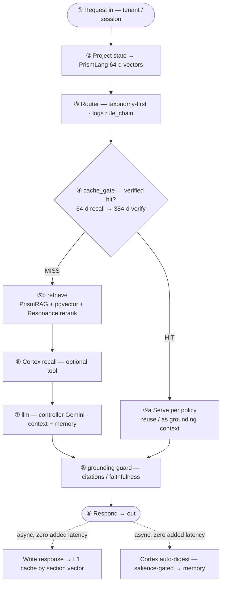

# ChorusGraph — Runtime Workflow (one turn)

How a single turn flows through ChorusGraph. Companion to [`DESIGN_v0.2.md`](DESIGN_v0.2.md) §7–§8, §13.

## Step table

| # | Action | Component(s) | Status | Notes |
|---|--------|--------------|--------|-------|
| ① | Request in | runtime | exists | Resolve tenant/session |
| ② | Project state → 64-d | PrismLang `PrismProjector` | exists | Tenant-seeded 384→64; one projection per section update |
| ③ | Route | Router (taxonomy-first, LLM fallback) | exists | Deterministic + reproducible; emits `rule_chain` |
| ④ | **cache_gate** | PrismCache + Resonance | **new (two-stage)** | 64-d coarse recall → 384-d verify before authorizing a skip (§8) |
| ⑤a | **Fast path** — serve cached | PrismCache | new (policy gate) | `exact`/`replay_safe` reuse; generative reused only as context, never verbatim |
| ⑤b | Retrieve KB | PrismRAG + pgvector + Resonance | exists | Only on a miss |
| ⑥ | Cortex recall (tool) | PrismCortex | post-MVP, optional | Pull a known fact with provenance |
| ⑦ | LLM call | controller (Gemini) | exists | Context + injected memory |
| ⑧ | Grounding guard | `hallucination_guard` | exists | Citation validity (+ faithfulness, planned) |
| ⑨ | Respond | runtime | exists | Response ships here |
| async | Write cache | PrismCache | new | After ⑨ — off the turn |
| async | Cortex auto-digest | PrismCortex | post-MVP | Salience-gated, async — zero added latency (§13.3) |

## The two paths

- **Fast path (verified cache hit):** ① → ② → ③ → ④ → ⑤a → ⑧ → ⑨. **Skips retrieve + LLM** — this is the cost/latency win. Safe only because of the two-stage verify (§8).
- **Full path (miss):** ① → ② → ③ → ④ → ⑤b → ⑥ → ⑦ → ⑧ → ⑨. Pays the full cost plus a small cache-lookup tax.

## Cross-cutting

- **Route Ledger** logs every step: `rule_chain`, cache hit + score, grounding score, per-node timing. Durable + queryable — the "observability without LangSmith" story. **This is what Handoff 1 builds.**
- **Async side-effects** (cache-write, Cortex digest) run *after* ⑨ so they never add latency to the user's turn.
- **Transport:** in-proc hops use the PrismLang envelope; cross-service/region hops use CHORUS; cross-tenant uses PrismAPI (only relevant for distributed topologies — see the distributed workflow, TBD).

---
*Design only · no implementation committed · companion to DESIGN_v0.2.md.*
